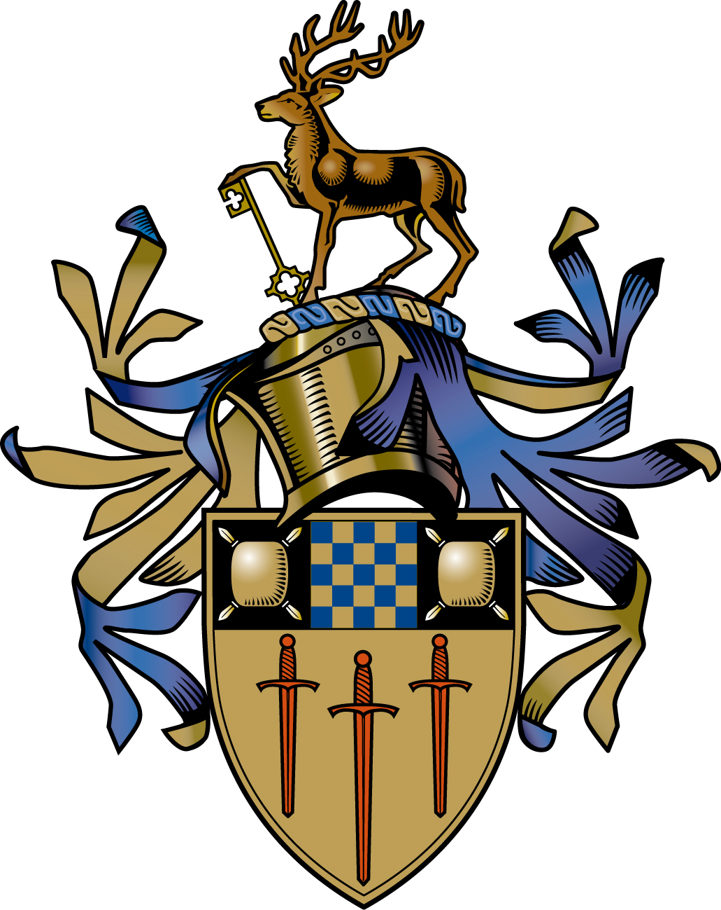

# Representations for Sign Language Production

**Harry Walsh**

Submitted for the Degree of

**Doctor of Philosophy**

from the

**University of Surrey**

[//]: # (![ColourCrest.jpg]&#40;ColourCrest.jpg&#41;{: width="20%" height="20%"})

**Centre for Vision, Speech and Signal Processing**

**Faculty of Engineering and Physical Sciences**

**University of Surrey**

Guildford, Surrey GU2 7XH, U.K.

September 2024

© Harry Walsh 2024

# Qualitative Evaluation
## Sign Stitching
[Chapter 5](./ch5/README.md)

## Vector Quantized Sign Language Production
[Chapter 6 ](./ch6/README.md)

## Thesis PDF 

Link to Thesis: [Harry_Walsh_Thesis.pdf](https://github.com/user-attachments/files/23163524/Harry_Walsh_Thesis.pdf)

Copyright (c) 2025 Harry Walsh
