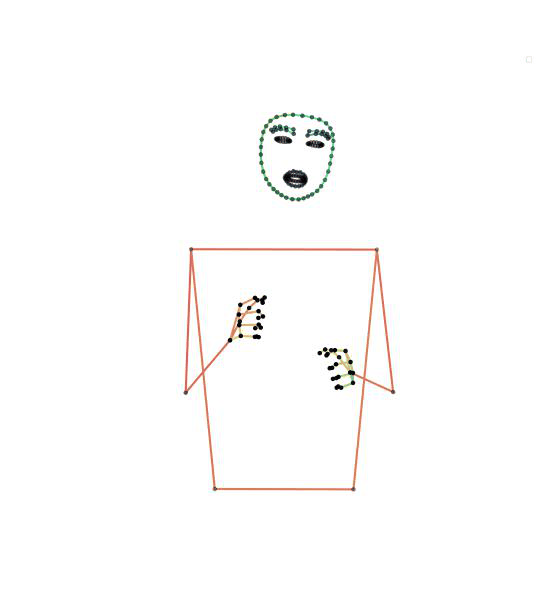
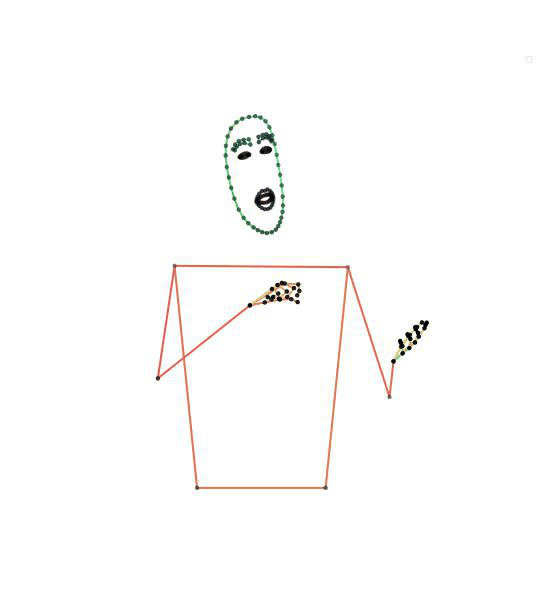
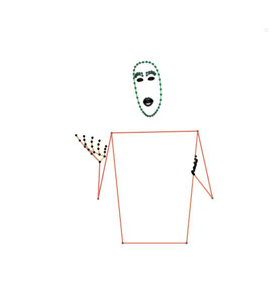

## Chapter 6: Vector Quantized Sign Language Production - Qualitative Evaluation

By applying Vector Quantisation (VQ) to sign language data, we first learn a codebook of short motions that can be combined to create a natural sequence of sign. Where each token in the codebook can be thought of as the lexicon of our representation. Then using a transformer, we perform a translation from spoken language text to a sequence of codebook tokens. Each token can be directly mapped to a sequence of poses allowing the translation to be performed by a single network.

Overview of the approach to Sign Language Production (SLP) using Vector Quantization (VQ:

![system_overview]
*Fig. 1: A overview of our approach to Sign Language Production ( SLP). Showing from top to bottom 1) the source spoken language sentence, 2) the data-driven token representation of sign, 3) the synthesized pose sequence, and, 4) the original video.*

## Contents
- [Codebook Visualization](#codebook-visualization)
  - [RWTH-PHOENIX-Weather-2014**T**](#rwth-phoenix-weather-2014t)
  - [Meine DGS Annotated](#meine-dgs-annotated)
- [Translation Examples](#translation-examples)
  - [German Sign Language - Deutsche Gebärdensprache](#german-sign-language---deutsche-gebärdensprache)
  - [Meine DGS Annotated](#meine-dgs-annotated-1)
  - [Stitching Module](#stitching-module)
  - [SignGAN Module](#signgan-module)
  - [Comparison to Progressive Transformer](#comparison-to-progressive-transformer)
- [Publicly Released Code](#publicly-released-code)

    
Previous approaches to SLP attempt to regress pose directly from the spoken language. This leads to under-articulated signing, as the signer regresses to the mean. Whereas, here by first learning a codebook we can ensure our new lexicon is expressive.

## Codebook Visualization

Here we present example tokens from the Codebooks.

### RWTH-PHOENIX-Weather-2014**T**

<table style="border-collapse: collapse;">
<tr>
  <td></td>
  <td></td>
  <td></td>
  <td></td>
  <td></td>
</tr>
<tr>
  <td></td>
  <td></td>
  <td></td>
  <td></td>
  <td></td>
</tr>
<tr>
  <td></td>
  <td></td>
  <td></td>
  <td></td>
  <td></td>
</tr>
<tr>
  <td></td>
  <td></td>
  <td></td>
  <td></td>
  <td></td>
</tr>
<tr>
  <td></td>
  <td></td>
  <td></td>
  <td></td>
  <td></td>
</tr>
</table>

### Meine DGS Annotated

<table style="border-collapse: collapse;">
<tr>
    <td></td>
    <td></td>
    <td></td>
    <td></td>
    <td></td>
  </tr>
  <tr>
    <td></td>
    <td></td>
    <td></td>
    <td></td>
    <td></td>
  </tr>
  <tr>
    <td></td>
    <td></td>
    <td></td>
    <td></td>
    <td></td>
  </tr>
  <tr>
    <td></td>
    <td></td>
    <td></td>
    <td></td>
    <td></td>
  </tr>
  <tr>
    <td></td>
    <td></td>
    <td></td>
    <td></td>
    <td></td>
  </tr>
</table>

## Translation Examples

Here we present translation examples.

**Left skeleton** - the ground truth extracted from the original videos. 

**Middel skeleton** - applying the codebook to quantize the ground truth sequence.

**Right skeleton**  - the translation output from the Text-to-Tokens transformer. 

Note, in the following examples we show the baseline model without the stitching module. In "Comparison to Progressive Transformer" below we add the stitching module to show its effectiveness for creating smoother natural signing sequences.

### German Sign Language - Deutsche Gebärdensprache

#### RWTH-PHOENIX-Weather-2014**T**

Failure case:

The PHOENIX14T dataset only contains a single view of the signer. As a result, our pose estimator struggles to capture some high-frequency movements, as can be seen in the ground truth data. 
In addition, for longer sequences, the model can struggle to capture all the fine-grain detail in the handshape.

#### Meine DGS Annotated

Failure case:

The Meine DGS dataset is captured from two native deaf signers having a conversation, while the Phoenix dataset comes from TV weather broadcasts. The result is that the camera setups used are distinctly different. Signers from the Meine DGS dataset are looking at each other while the camera is off-center. The result is a slight morphing in the face mesh shape.

Plus, as Meine DGS is a challenging dataset, errors can occure from the transltion. As expected from the low resoruce language. The following examples visulise the errors.

#### Stitching Module

#### SignGAN Module

Here we present outputs from the SignGAN module. The SignGAN module is trained to generate realistic signing sequences. But we do note some artifacts in the generated sequences, caused by projecting the skeleton to 2D.

#### Comparison to Progressive Transformer

Here we compare our full approach to the progressive transformer. We apply stitching module. Hence, the examples show smooth continuous signing.

(<a href="#readme-top">back to top</a>)

## Publicly Released Code

📌 Companion codebase: [Sign VQ Transformer](https://github.com/walsharry/Sign-VQ-Transformer)

<!-- MARKDOWN LINKS & IMAGES -->
[system_overview]: Images/vq_slp_overview.png
[license-shield]: https://img.shields.io/github/license/othneildrew/Best-README-Template.svg?style=for-the-badge
[license-url]: https://github.com/othneildrew/Best-README-Template/blob/master/LICENSE.txt

Copyright (c) 2025 Harry Walsh
